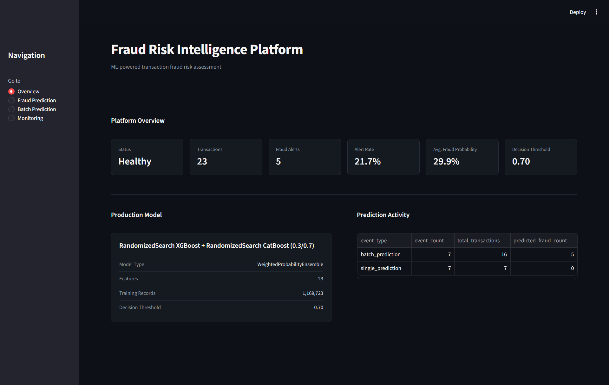
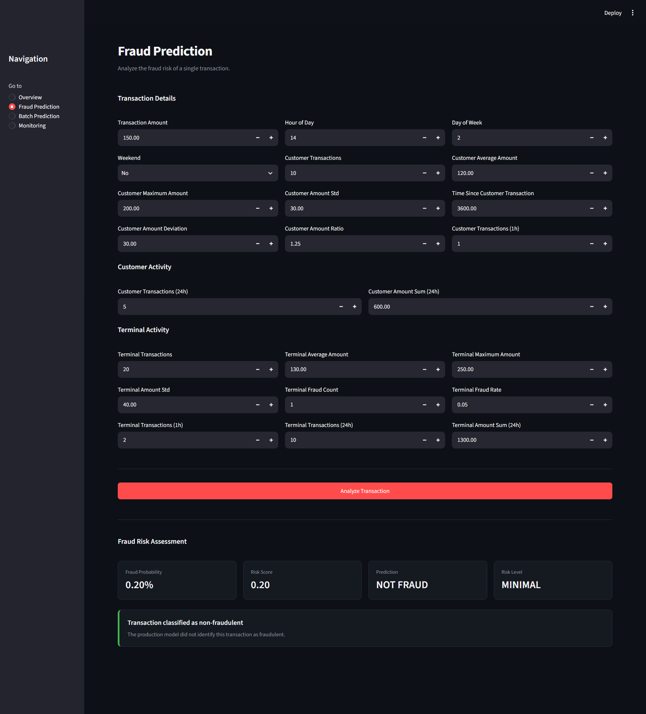
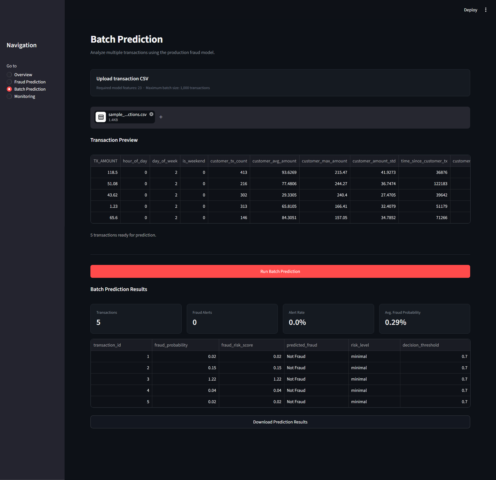
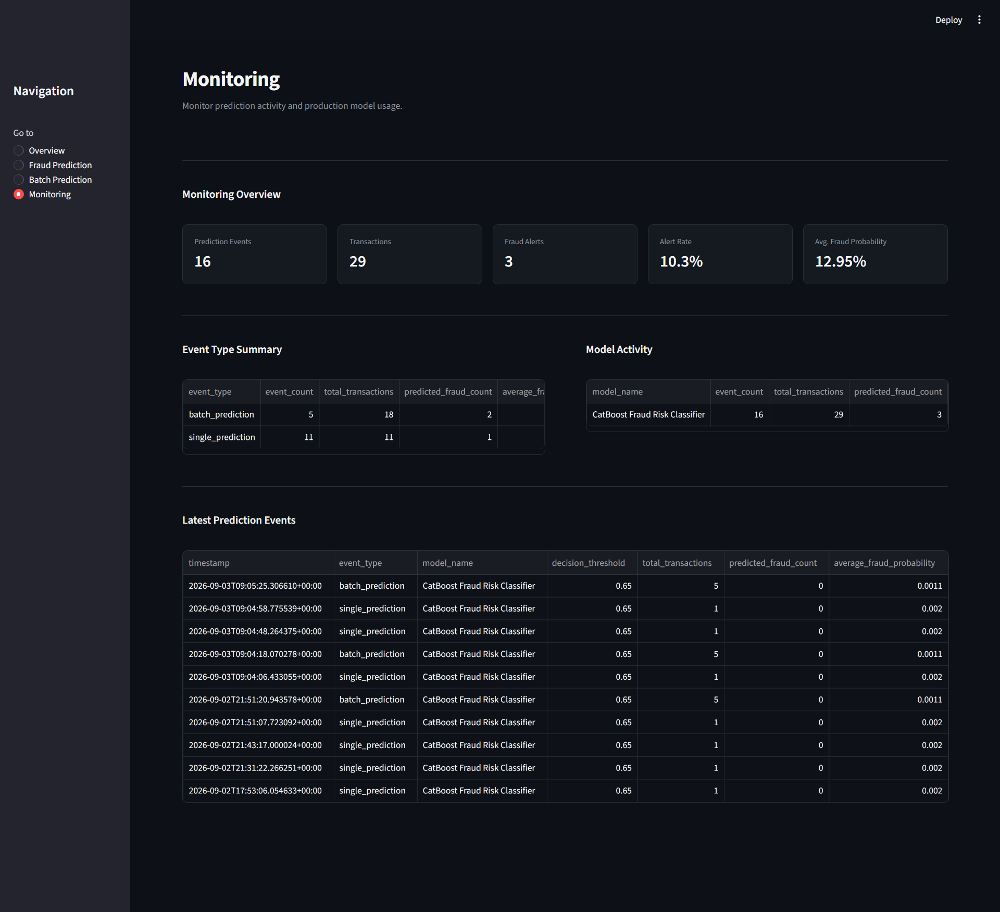
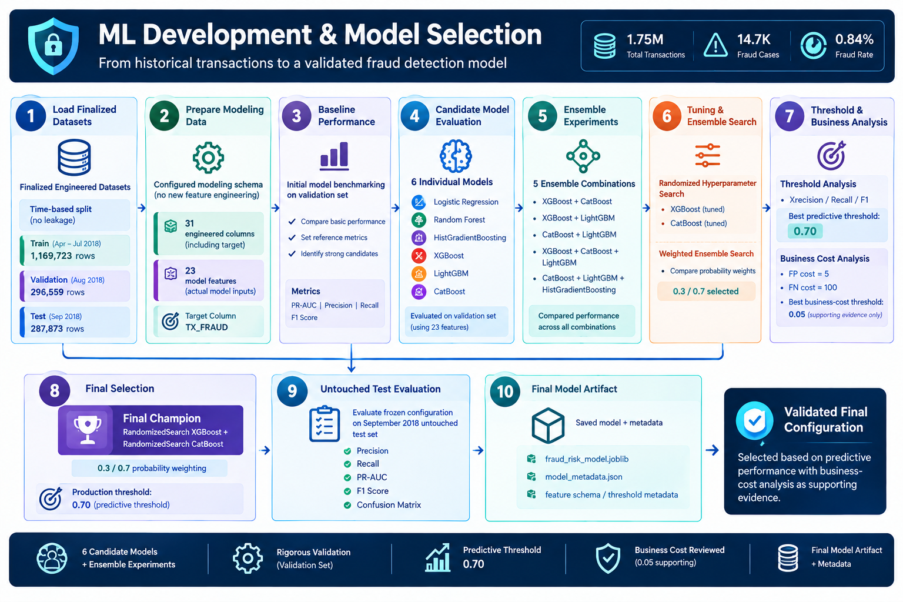
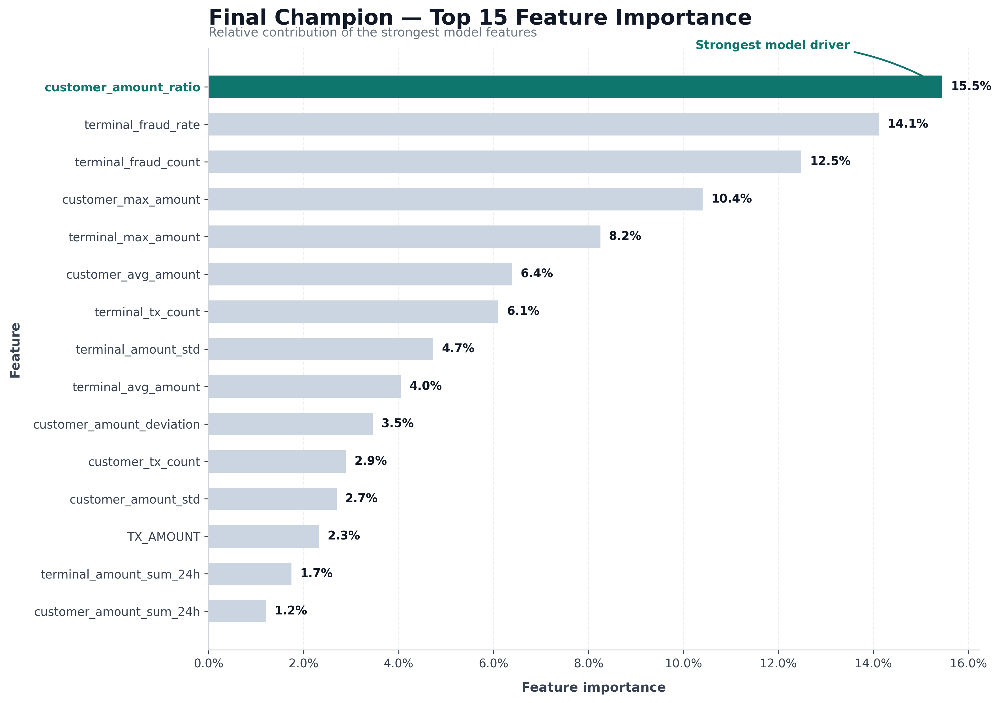
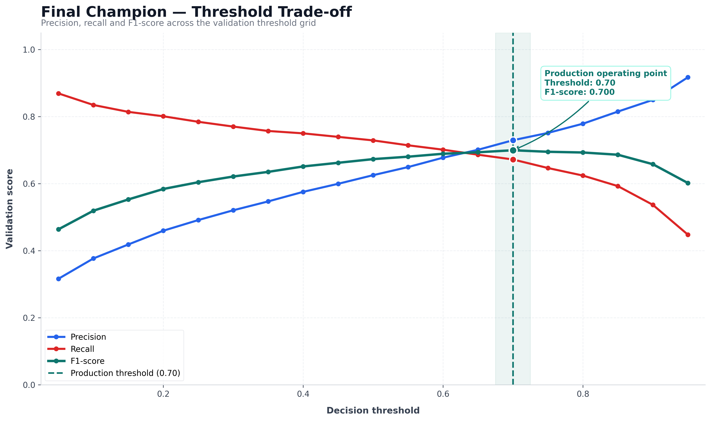
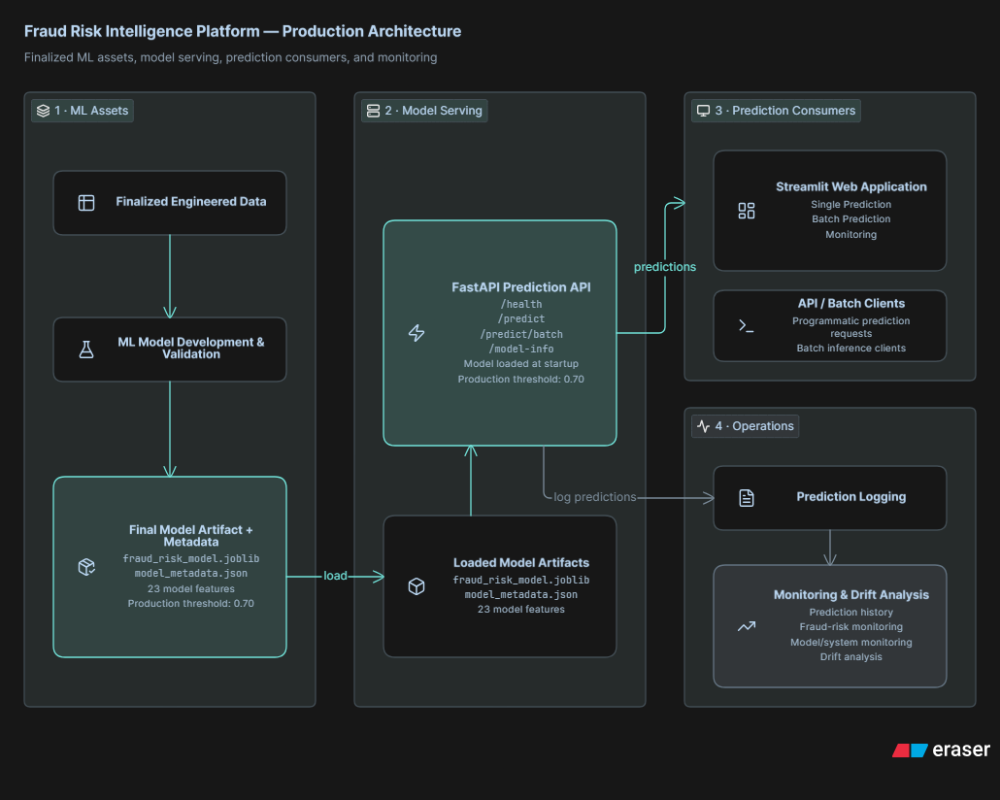
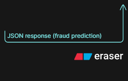

# Fraud Risk Intelligence Platform

> An end-to-end machine learning and MLOps-oriented platform for transaction fraud detection, risk scoring, model evaluation, API serving, and operational monitoring.

<p align="center">

[](https://www.python.org/)
[](https://fastapi.tiangolo.com/)
[](https://streamlit.io/)
[](https://www.docker.com/)
[](#automated-testing)
[](#license)

</p>

<p align="center">

<a href="https://fraud-risk-intelligence-platform-aphxdzhavgtqbxxkxxxztb.streamlit.app/">
  
</a>

<a href="https://fraud-risk-intelligence-platform.onrender.com/docs">
  
</a>

<a href="https://github.com/Swaransh-Mishra/fraud-risk-intelligence-platform">
  
</a>

</p>

---

## Project Snapshot

**Fraud Risk Intelligence Platform** is a production-oriented machine learning and MLOps project that transforms transaction-level behavioural signals into fraud probabilities, risk scores, and operational decisions.

The platform covers the broader machine learning lifecycle — from **historical transaction data and feature engineering through model development, validation, threshold selection, model persistence, API serving, interactive prediction, logging, monitoring, and deployment**.

### At a Glance

| Component | Final Configuration |
| --- | --- |
| Dataset | 1,754,155 transactions |
| Fraud Cases | 14,681 |
| Fraud Prevalence | ~0.84% |
| Model Features | 23 |
| Final Champion | RandomizedSearch XGBoost + RandomizedSearch CatBoost |
| Ensemble Weights | XGBoost 0.3 · CatBoost 0.7 |
| Production Threshold | 0.70 |
| Validation PR-AUC | 0.746233 |
| Validation F1-score | 0.699688 |
| Final Test PR-AUC | 0.584143 |
| Final Test Recall | 0.622693 |
| Final Test F1-score | 0.537718 |
| Automated Tests | 82 passed |

---

## Key Results

### Final Model

**RandomizedSearch XGBoost + RandomizedSearch CatBoost**

A weighted probability ensemble combining the tuned XGBoost and CatBoost models with weights of **0.3** and **0.7**, respectively.

The production decision threshold was selected using the validation workflow and frozen at **0.70** before evaluation on the untouched September 2018 test period.

### Final Holdout Performance

| Metric | September 2018 Test |
| --- | ---: |
| PR-AUC | **0.584143** |
| ROC-AUC | **0.972573** |
| Precision | **0.473150** |
| Recall | **0.622693** |
| F1-score | **0.537718** |

The September 2018 period represents the **unseen temporal holdout**, providing a final evaluation of the frozen model configuration on later transaction data.

---

## What the Platform Delivers

- **Fraud probability scoring** for individual transactions
- **Risk scoring and risk-level decisions**
- **Batch transaction prediction**
- **Chronological model validation**
- **Imbalanced-class evaluation using PR-AUC, precision, recall, and F1**
- **Probability-weighted ensemble prediction**
- **Configurable decision thresholds**
- **Business-cost analysis**
- **Reusable FastAPI inference service**
- **Interactive Streamlit application**
- **Prediction logging and operational monitoring**
- **Model and metadata persistence**
- **Dockerized API serving**
- **Automated application testing**

---

## Why This Project

Fraud detection is a highly imbalanced classification problem where fraudulent transactions represent only a small proportion of total transaction activity.

A useful fraud-risk system therefore needs to do more than maximize accuracy. It should identify suspicious transactions while providing probability-based risk estimates, configurable decision thresholds, and operational visibility into model predictions.

This project was built to demonstrate the complete transition from **machine learning experimentation to a reusable fraud-risk application**, combining predictive modeling with API serving, interactive application workflows, prediction logging, monitoring, testing, and deployment.

---

## Business Problem

A fraud detection system needs to balance two competing types of errors:

- **False positives** — legitimate transactions incorrectly flagged for investigation
- **False negatives** — fraudulent transactions missed by the model

Because fraud is rare, accuracy alone can provide a misleading view of model quality.

The platform therefore emphasizes:

- **PR-AUC** for ranking performance under class imbalance
- **Precision and recall** for fraud detection effectiveness
- **F1-score** for threshold-dependent performance
- **False-positive and false-negative volumes**
- **Decision-threshold analysis**
- **Business-cost analysis**

The final system converts model probabilities into operational risk decisions through a frozen production threshold of **0.70**.

---

## Product Showcase

The platform is exposed through an interactive **Streamlit** application backed by a reusable **FastAPI** inference service.

The interface provides individual transaction scoring, batch prediction, and monitoring workflows while keeping model inference inside the backend service.

### Platform Overview

The main interface provides a consolidated view of the fraud-risk platform, including the active model configuration, prediction activity, and operational status.

<p align="center">
  
</p>

### Fraud Prediction

The fraud prediction interface accepts the finalized **23-feature modeling schema** and returns a fraud probability, risk score, prediction, and risk level.

<p align="center">
  
</p>

### Batch Prediction

The batch workflow supports CSV-based transaction scoring and returns fraud probabilities and risk decisions for multiple transactions.

<p align="center">
  
</p>

### Monitoring

The monitoring interface provides visibility into prediction activity and available operational monitoring information.

<p align="center">
  
</p>

---

## ML Development & Model Selection

The machine learning workflow was designed around chronological evaluation and progressive model development.

Finalized engineered datasets are prepared using a consistent modeling schema, followed by baseline benchmarking, candidate model evaluation, ensemble experimentation, hyperparameter tuning, threshold analysis, and final model selection.

The validation period is used for model and decision-making throughout development, while the September 2018 period remains an untouched final holdout.

<p align="center">
  
</p>

The final configuration combines the tuned models that provided the strongest validation performance and is persisted as a reusable model artifact with its associated metadata.

---

## Data & Feature Engineering

### Dataset

The platform is built using a transaction-level fraud dataset containing **1,754,155 transactions** across a six-month period from **April through September 2018**.

| Attribute | Value |
| --- | ---: |
| Total Transactions | 1,754,155 |
| Fraudulent Transactions | 14,681 |
| Fraud Prevalence | ~0.84% |
| Customers | 4,990 |
| Terminals | 10,000 |
| Time Period | April–September 2018 |
| Raw Columns | 9 |

The low fraud prevalence creates a highly imbalanced classification problem. Consequently, model evaluation focuses on metrics that better reflect minority-class performance rather than accuracy alone.

---

## Feature Engineering

The feature engineering process transforms transaction history into behavioural signals describing the current transaction, customer behaviour, and terminal behaviour.

The finalized engineered dataset contains **31 columns including the target**, while the final modeling schema uses **23 features** for prediction.

### Feature Groups

#### Transaction & Temporal Signals

- `TX_AMOUNT`
- `hour_of_day`
- `day_of_week`
- `is_weekend`

These features describe the transaction amount and its temporal context.

#### Customer Behaviour

- `customer_tx_count`
- `customer_avg_amount`
- `customer_max_amount`
- `customer_amount_std`
- `time_since_customer_tx`

These features capture the customer's historical transaction behaviour.

#### Customer Amount Behaviour

- `customer_amount_deviation`
- `customer_amount_ratio`

These signals compare the current transaction amount with the customer's historical spending behaviour.

#### Customer Recent Activity

- `customer_tx_count_1h`
- `customer_tx_count_24h`
- `customer_amount_sum_24h`

These features capture short-term transaction frequency and spending activity.

#### Terminal Behaviour

- `terminal_tx_count`
- `terminal_avg_amount`
- `terminal_max_amount`
- `terminal_amount_std`

These features describe historical transaction behaviour associated with the terminal.

#### Terminal Fraud History

- `terminal_fraud_count`
- `terminal_fraud_rate`

These features capture historical fraud activity associated with the terminal.

#### Terminal Recent Activity

- `terminal_tx_count_1h`
- `terminal_tx_count_24h`
- `terminal_amount_sum_24h`

These features capture recent transaction activity at the terminal level.

---

## Chronological Data Splitting

Because fraud behaviour and historical features are time-dependent, the project uses a chronological train, validation, and final holdout strategy rather than a random split.

| Dataset | Period | Records | Purpose |
| --- | --- | ---: | --- |
| Training | April–July 2018 | 1,169,723 | Model development |
| Validation | August 2018 | 296,559 | Model selection and threshold analysis |
| Final Test | September 2018 | 287,873 | Unseen temporal holdout |

The **September 2018 test period is kept untouched** during model development, ensemble selection, and threshold selection.

This setup provides a more realistic evaluation of how the finalized configuration performs on later transaction data.

---

## Model Selection

Six individual classification models were evaluated as candidate approaches:

1. Logistic Regression
2. Random Forest
3. HistGradientBoosting
4. XGBoost
5. LightGBM
6. CatBoost

Because the dataset is highly imbalanced, candidate models were compared using **PR-AUC** as the primary ranking metric, supported by precision, recall, and F1-score.

---

## Ensemble Experiments

Individual model performance was followed by probability-based ensemble experiments to determine whether combining complementary gradient-boosting models could improve validation performance.

The evaluated combinations included:

- XGBoost + CatBoost
- XGBoost + LightGBM
- CatBoost + LightGBM
- XGBoost + CatBoost + LightGBM
- CatBoost + LightGBM + HistGradientBoosting
- Tuned and weighted ensemble variants

The ensemble experiments operate on predicted fraud probabilities rather than hard class predictions, allowing the component models to contribute different levels of influence.

---

## Hyperparameter Tuning

The strongest ensemble candidates were further refined using randomized hyperparameter search.

The final ensemble uses:

- **RandomizedSearch XGBoost**
- **RandomizedSearch CatBoost**
- **XGBoost weight:** 0.3
- **CatBoost weight:** 0.7

This configuration produced the strongest validation performance within the evaluated modeling workflow and was selected as the final champion.

---

## Final Champion

### RandomizedSearch XGBoost + RandomizedSearch CatBoost

The final model is a weighted probability ensemble:

```text
Final Fraud Probability
    = 0.3 × XGBoost Probability
    + 0.7 × CatBoost Probability
```
## Threshold Selection

The decision threshold was evaluated on the validation period to understand the trade-off between precision, recall, and F1-score.

The final production threshold was set to:

**0.70**

The threshold was frozen before evaluating the September 2018 holdout.

A separate business-cost analysis was also performed using the project assumptions of:

- **False positive cost:** 5
- **False negative cost:** 100

The lowest estimated business cost occurred at a lower threshold of **0.05**. This analysis is treated as supporting sensitivity analysis rather than the production threshold, which remains **0.70** based on the validation predictive-performance workflow.

---

## Validation Performance

The final champion achieved the following validation results:

| Metric | Validation |
| --- | ---: |
| PR-AUC | **0.746233** |
| F1-score | **0.699688** |

These results were used during model and threshold selection.

The final model configuration, ensemble weighting, and production threshold were then frozen before evaluating the later September 2018 holdout period.

---

## Final Holdout Evaluation

The **September 2018** dataset was not used for model selection, hyperparameter tuning, ensemble weighting, or threshold selection.

It was used only for final evaluation of the frozen configuration.

| Metric | September 2018 Test |
| --- | ---: |
| PR-AUC | **0.584143** |
| ROC-AUC | **0.972573** |
| Precision | **0.473150** |
| Recall | **0.622693** |
| F1-score | **0.537718** |

The difference between validation and holdout performance reflects the challenge of maintaining fraud-detection performance on later unseen transaction activity.

---

## Final Test Confusion Matrix

At the frozen **0.70** decision threshold, the September 2018 holdout produced:

| | Predicted Legitimate | Predicted Fraud |
| --- | ---: | ---: |
| **Actual Legitimate** | 283,560 | 1,766 |
| **Actual Fraud** | 961 | 1,586 |

This corresponds to:

- **True Negatives:** 283,560
- **False Positives:** 1,766
- **False Negatives:** 961
- **True Positives:** 1,586

The confusion matrix provides the operational view behind the final precision and recall results.

---
## Model Evaluation Visualizations

The following visualizations provide the analytical evidence behind model comparison, feature contribution, threshold selection, business-cost analysis, and final holdout performance.

### Model Comparison

PR-AUC is used as the primary comparison metric because the dataset contains a highly imbalanced fraud class.

<p align="center">
  
</p>

The comparison includes the evaluated individual models and ensemble configurations used during model development.

---

### Final Champion Feature Importance

Feature importance from the final champion highlights the behavioural and transaction signals that contributed most strongly to the model's predictions.

<p align="center">
  
</p>

The analysis uses the finalized **23 model features**, providing an interpretable view of the signals used by the deployed model.

---

### Threshold Trade-off

The threshold analysis shows how changing the fraud decision threshold affects predictive performance.

<p align="center">
  
</p>

The production threshold of **0.70** was selected through the validation predictive-performance workflow and frozen before final holdout evaluation.

---

### Business Cost Analysis

A separate business-cost analysis evaluates the impact of false positives and false negatives under the project's assumed costs.

<p align="center">
  
</p>

Using the assumptions of **5 cost units for a false positive** and **100 cost units for a false negative**, the lowest estimated cost occurs at a threshold of **0.05**.

This analysis is used as supporting sensitivity analysis rather than replacing the production threshold selected through predictive validation.

---

### Final Holdout Confusion Matrix

The confusion matrix shows the actual classification outcomes on the untouched September 2018 test period at the frozen **0.70** threshold.

<p align="center">
  
</p>

The holdout contains:

- **True Negatives:** 283,560
- **False Positives:** 1,766
- **False Negatives:** 961
- **True Positives:** 1,586

---

### Precision-Recall Curve

The precision-recall curve provides a threshold-independent view of fraud detection performance under severe class imbalance.

<p align="center">
  
</p>

The final champion achieved a **0.584143 PR-AUC** on the September 2018 holdout period.

---

## Production System & MLOps

The platform extends beyond model development into a reusable inference and operational workflow.

The finalized model configuration is persisted with its metadata and loaded by the FastAPI service for consistent inference across application clients.

Key operational capabilities include:

- Persisted model artifacts and metadata
- Reusable API-based inference
- Individual transaction prediction
- Batch prediction
- Prediction logging
- Operational monitoring
- Model configuration visibility
- Dockerized API serving
- Automated application testing
- Cloud deployment

## Production Architecture

The production architecture separates the finalized machine learning workflow from the runtime inference layer.

<p align="center">
  
</p>

The deployed system connects the finalized model workflow to the FastAPI inference service and application clients, with prediction logging and monitoring supporting the operational lifecycle.

## Deployment & Runtime Architecture

The application is deployed as separate frontend and backend services.

<p align="center">
  
</p>

The Streamlit frontend communicates with the containerized FastAPI backend through HTTPS API requests, while the backend loads the persisted model artifacts for inference.

## API Serving

The FastAPI service exposes the model through HTTP endpoints for reusable inference.

### Core Endpoints

| Endpoint | Purpose |
| --- | --- |
| `/health` | Service health check |
| `/predict` | Individual transaction prediction |
| `/predict-batch` | Batch transaction prediction |
| `/model-info` | Active model and configuration information |
| `/docs` | Interactive Swagger API documentation |

The API returns structured prediction information including fraud probability, risk score, prediction, and risk level.

---

## Model Persistence

The finalized model configuration is stored as reusable artifacts rather than being recreated during application startup.

The deployment uses:

- `fraud_risk_model.joblib` — persisted model artifact
- `model_metadata.json` — model configuration and metadata

The metadata records information required by the inference service, including the finalized modeling schema, decision threshold, and relevant training/evaluation information.

---

## Operational Monitoring

Prediction logging provides an operational record of inference activity that can be used for monitoring and later analysis.

The monitoring workflow is designed around signals such as:

- Prediction volume
- Fraud prediction rate
- Prediction probabilities
- Risk-level distribution
- Recent prediction activity

This provides a foundation for monitoring model behaviour after deployment and identifying potential changes in incoming prediction patterns.

---


## Technical Stack

### Machine Learning & Data

- **Python 3.11**
- **pandas** — data preparation and feature engineering
- **NumPy** — numerical operations
- **scikit-learn** — preprocessing, model evaluation, hyperparameter search, and supporting ML utilities
- **XGBoost** — gradient-boosting model
- **CatBoost** — gradient-boosting model
- **joblib** — model artifact persistence

### Application & API

- **FastAPI** — model inference API
- **Pydantic** — request and response validation
- **Streamlit** — interactive application interface
- **Uvicorn** — ASGI server

### Deployment & Engineering

- **Docker** — containerized API serving
- **Render** — FastAPI cloud deployment
- **Streamlit Cloud** — frontend deployment
- **Git & GitHub** — source control and project versioning
- **pytest** — automated testing

---

## Engineering & ML Practices

The project emphasizes reproducibility, separation of concerns, and validation throughout the machine learning lifecycle.

### Machine Learning

- Chronological train/validation/test splitting
- Strict separation of the final temporal holdout
- Imbalanced-class evaluation using PR-AUC
- Multiple candidate model benchmarks
- Probability-based ensemble experimentation
- Randomized hyperparameter search
- Validation-based threshold analysis
- Separate business-cost sensitivity analysis
- Frozen model configuration before final holdout evaluation

### Software Engineering

- Reusable inference code outside the notebook environment
- Separation between model development and application inference
- Persisted model artifacts and metadata
- API request/response validation
- Configurable deployment settings
- Dockerized backend service
- Automated test coverage
- Version-controlled source code

### MLOps-Oriented Practices

- Model artifact persistence
- Metadata persistence
- API-based model serving
- Containerized deployment
- Prediction logging
- Operational monitoring
- Cloud deployment
- Automated testing

These practices provide a practical MLOps-oriented workflow without treating the project as a full-scale production system.

---

## Assumptions & Limitations

### Modeling Assumptions

The project assumes that historical customer and terminal transaction behaviour provides useful signals for identifying anomalous transactions.

The production decision threshold is fixed at **0.70** based on the validation workflow. Different organizations may require different thresholds depending on investigation capacity, fraud losses, customer impact, and operational requirements.

### Business-Cost Assumptions

The supporting cost analysis assumes:

- **False positive cost:** 5
- **False negative cost:** 100

These values are illustrative business assumptions rather than observed financial costs from a real organization.

### Data Limitations

- The dataset represents a defined historical transaction period rather than continuously changing live transaction data.
- Historical behavioural features may not fully represent future fraud patterns.
- Model performance can change when transaction behaviour, fraud strategies, or operational conditions shift.
- The final September 2018 holdout provides temporal validation but does not guarantee future real-world performance.

### Deployment Limitations

- The deployed service is intended as a portfolio-scale demonstration of an ML inference workflow.
- Cloud infrastructure behaviour, including cold starts on free-tier services, can affect response latency.
- Monitoring provides an operational foundation but does not represent a complete enterprise observability stack.
- No claim is made that the system is ready for direct deployment into a regulated financial production environment without additional security, scalability, governance, and monitoring controls.

---

## Deployment

The platform is deployed using separate frontend and backend services.

### Backend Deployment

The FastAPI inference service is containerized with Docker and deployed on Render.

**Live API:**
https://fraud-risk-intelligence-platform.onrender.com

**Swagger API Documentation:**
https://fraud-risk-intelligence-platform.onrender.com/docs

**Health Check:**
https://fraud-risk-intelligence-platform.onrender.com/health

The backend loads the persisted model artifact and exposes the inference endpoints used by the application.

### Frontend Deployment

The Streamlit application is deployed separately on Streamlit Community Cloud.

**Live Application:**
https://fraud-risk-intelligence-platform-aphxdzhavgtqbxxkxxxztb.streamlit.app/

The Streamlit frontend communicates with the deployed FastAPI backend through HTTPS API requests.

The backend URL is configured through the Streamlit deployment configuration using `API_BASE_URL`.

---

## Repository

The complete source code and project assets are available on GitHub.

**GitHub Repository:**
https://github.com/Swaransh-Mishra/fraud-risk-intelligence-platform

### Clone the Repository

```bash
git clone https://github.com/Swaransh-Mishra/fraud-risk-intelligence-platform.git
cd fraud-risk-intelligence-platform
```

### Create a Virtual Environment

#### Windows

```bash
python -m venv .venv
.venv\Scripts\activate
```

#### macOS / Linux

```bash
python3 -m venv .venv
source .venv/bin/activate
```

### Install Dependencies

```bash
pip install -r requirements.txt
```

---

## Running Locally

The application consists of a FastAPI backend and a Streamlit frontend.

### Start the FastAPI Backend

From the project root:

```bash
uvicorn app.main:app --reload --port 8000
```

The API will be available at:

```text
http://localhost:8000
```

Swagger documentation:

```text
http://localhost:8000/docs
```

Health check:

```text
http://localhost:8000/health
```

### Start the Streamlit Frontend

Open a separate terminal, activate the same virtual environment, and run:

```bash
streamlit run streamlit/app.py
```

The Streamlit application will be available at:

```text
http://localhost:8501
```

The local Streamlit application communicates with the local FastAPI backend for model inference.

---

## Automated Testing

The project includes an automated test suite covering core application and inference behaviour.

Run the tests with:

```bash
pytest -q
```

Current test status:

```text
82 passed
```

Dependency consistency can also be checked with:

```bash
pip check
```

---

## Docker API Serving

The FastAPI backend can be built and served as a Docker container.

### Build the Docker Image

```bash
docker build -t fraud-risk-intelligence-platform .
```

### Run the Container

```bash
docker run -p 8000:8000 fraud-risk-intelligence-platform
```

The containerized API will then be available at:

```text
http://localhost:8000
```

Swagger documentation:

```text
http://localhost:8000/docs
```

Docker is used to provide a reproducible environment for API serving and cloud deployment.

---

## Repository Structure

```text
fraud-risk-intelligence-platform/
│
├── app/
│   ├── api/
│   ├── core/
│   ├── data_loader/
│   ├── evaluation/
│   ├── features/
│   ├── inference/
│   ├── models/
│   ├── monitoring/
│   ├── tracking/
│   └── main.py
│
├── artifacts/
│   ├── experiments/
│   ├── fraud_risk_model.joblib
│   └── model_metadata.json
│
├── assets/
│   └── plots/
│
├── data/
│   ├── processed/
│   ├── raw/
│   └── sample/
│
├── docs/
│   ├── docs/
│   └── methodology/
│
├── logs/
│
├── notebooks/
│   ├── 01_data_and_feature_analysis.ipynb
│   └── 02_model_development_and_evaluation.ipynb
│
├── scripts/
│
├── streamlit/
│   └── app.py
│
├── tests/
│
├── Dockerfile
├── requirements.txt
├── pytest.ini
├── .gitignore
├── LICENSE
└── README.md

```

## Swaransh Mishra

**Data Analyst • Business Analyst • Data Scientist**

### Connect with Me

<p align="left">

<a href="https://github.com/Swaransh-Mishra">

</a>

<a href="https://www.linkedin.com/in/swaransh-mishra-a85123258/">

</a>

<a href="mailto:swaransh03122003@gmail.com">

</a>

</p>

## License

This project is licensed under the **MIT License**.
