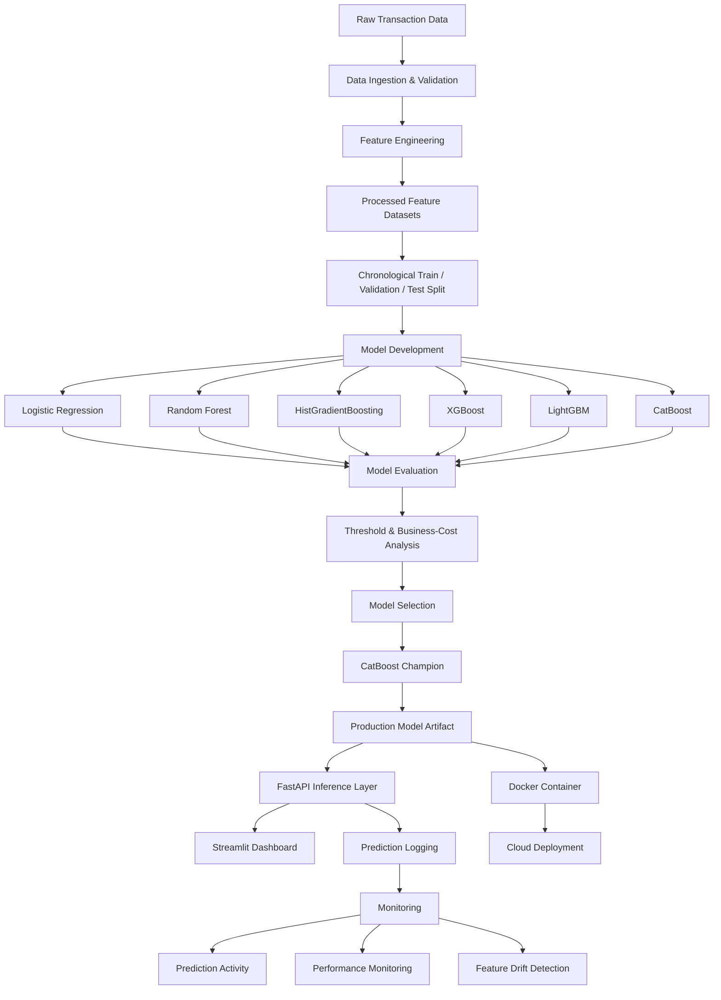
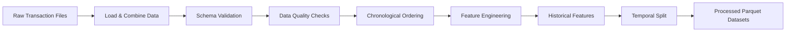
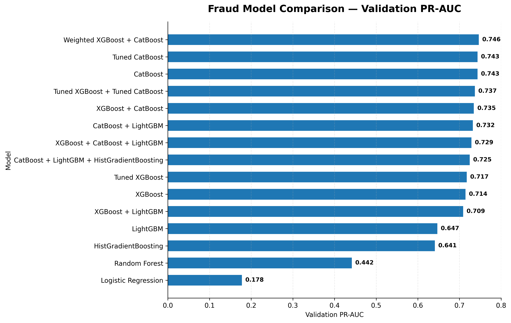
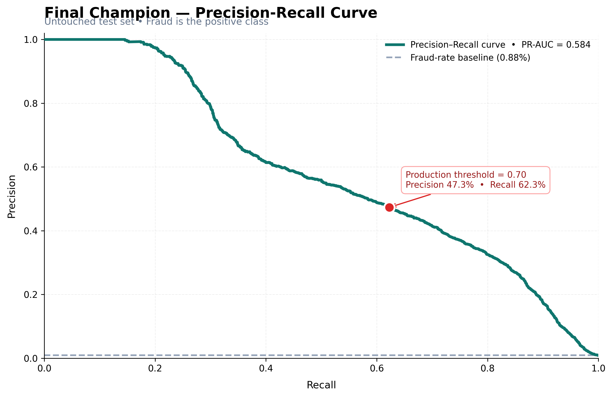
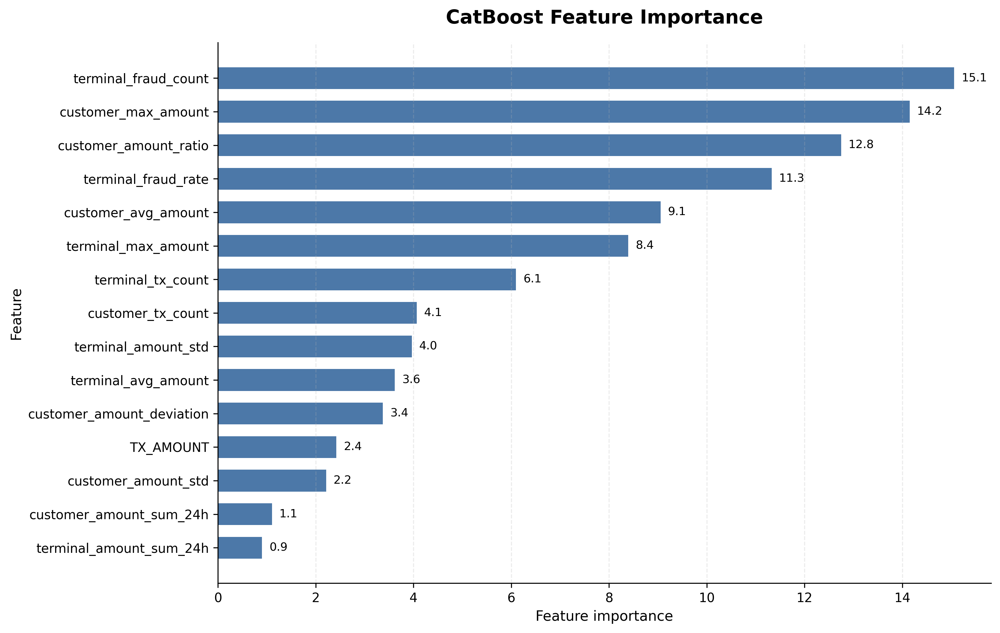
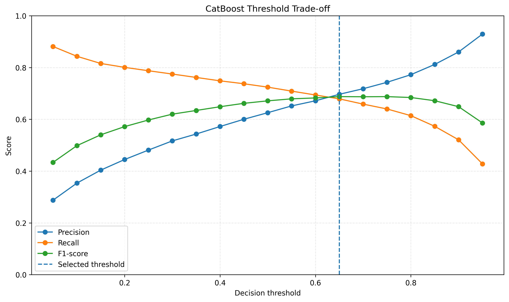
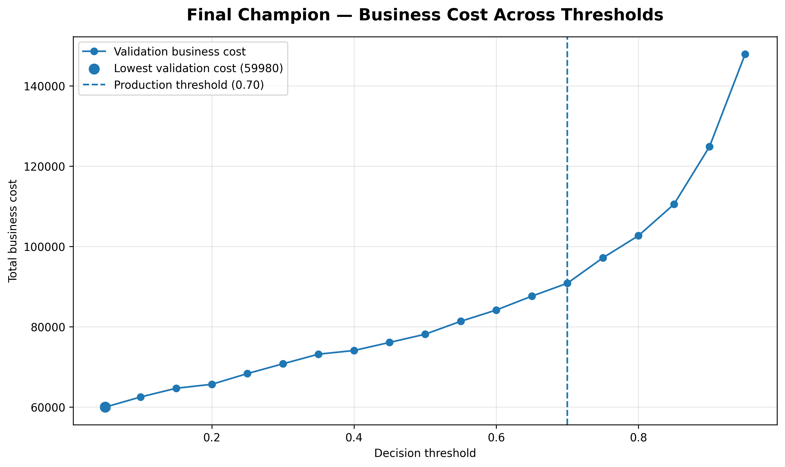
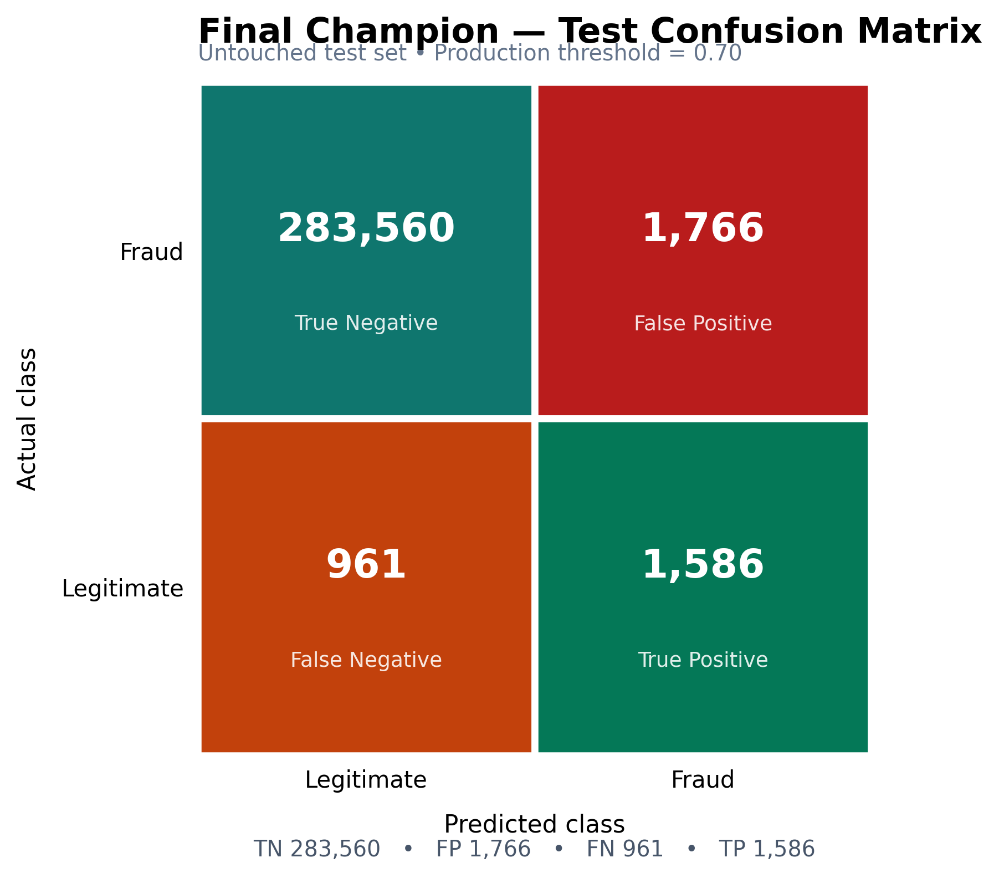

# Fraud Risk Intelligence Platform

> An end-to-end **ML Engineering & MLOps platform** for transaction fraud risk assessment, covering data preparation, leakage-safe feature engineering, model development, evaluation, model selection, production inference, monitoring, testing, and containerized deployment.

<p align="center">


<p align="center">

<a href="https://github.com/Swaransh-Mishra">GitHub</a>
&nbsp;•&nbsp;
<a href="https://www.linkedin.com/in/swaransh-mishra-a85123258/">LinkedIn</a>
&nbsp;•&nbsp;
<a href="mailto:swaransh03122003@gmail.com">Email</a>

</p>

</p>

---

## Project Overview

- **Domain:** Financial Transaction Fraud Detection
- **Project Type:** End-to-End ML Engineering & MLOps Platform
- **Problem:** Detect potentially fraudulent transactions while balancing fraud detection performance against false-positive customer friction.
- **Production Model:** CatBoost Fraud Risk Classifier
- **Decision Threshold:** `0.65`
- **Model Features:** `23`
- **Raw Transactions:** `1,754,155`
- **Raw Columns:** `9`
- **Fraud Transactions:** `14,681`
- **Fraud Rate:** `0.8369%`
- **Data Strategy:** Leakage-safe chronological train / validation / test split
- **Backend:** FastAPI
- **Frontend:** Streamlit
- **Inference:** Production model with centralized feature validation and metadata
- **Monitoring:** Prediction activity, model performance, and feature drift detection
- **Testing:** Automated application and API test suite
- **Containerization:** Docker
- **Deployment:** Cloud deployment

---

## Key Capabilities

### Data Engineering

- Transaction data ingestion
- Data quality validation
- Duplicate detection
- Identifier integrity checks
- Target validation
- Chronological ordering validation
- Leakage-safe dataset preparation

### Feature Engineering

- Transaction-level features
- Customer behavioral features
- Terminal behavioral features
- Historical transaction statistics
- Rolling customer activity
- Rolling terminal activity
- Amount deviation features
- Customer amount ratio features
- Fraud history features

### ML Engineering

- Reusable preprocessing pipeline
- Centralized model feature schema
- Logistic Regression baseline
- Random Forest
- HistGradientBoosting
- XGBoost
- LightGBM
- CatBoost
- Ensemble experimentation
- Consistent model evaluation
- Validation-based model comparison
- Untouched test-set evaluation

### Decision & Business Analysis

- Probability-based predictions
- Classification threshold analysis
- Precision / recall trade-off analysis
- F1-score optimization
- Business-cost optimization
- False-positive / false-negative cost analysis
- Cost sensitivity analysis
- Production threshold selection

### MLOps & Productionization

- Production model artifact management
- Model metadata management
- Dedicated model inference layer
- Reusable feature preparation
- Input feature validation
- Risk scoring
- Prediction event logging
- Model performance monitoring
- Feature drift detection
- Automated testing
- Dockerized model serving
- Cloud-ready deployment architecture

### API & Application

- REST API with FastAPI
- Interactive Swagger documentation
- Single transaction prediction
- Batch prediction
- Model information endpoint
- Health endpoint
- Monitoring endpoints
- Streamlit analytics dashboard
- Prediction activity visualization

---

## Project Highlights

| Component | Implementation |
|---|---|
| Project Focus | ML Engineering + MLOps |
| Dataset | `1.75M+` transaction records |
| Raw Features | `9` |
| Production Features | `23` |
| Data Split | Chronological train / validation / test |
| Candidate Models | 6 individual models + ensemble experiments |
| Production Model | CatBoost |
| Production Threshold | `0.65` |
| Business Cost | FP = `5`, FN = `100` |
| Backend | FastAPI |
| Frontend | Streamlit |
| Monitoring | Activity + Performance + Drift |
| Testing | Automated test suite |
| Containerization | Docker |
| Deployment | Cloud-ready / deployed |


---

## System Architecture

The platform follows a production-oriented architecture that separates the **ML lifecycle**, **model serving**, **application layer**, and **monitoring layer**.


---

## Dataset & Data Engineering

### Dataset Overview

The project uses a large-scale transaction dataset containing:

- **Total transaction records:** `1,754,155`
- **Raw columns:** `9`
- **Fraud transactions:** `14,681`
- **Overall fraud rate:** `0.8369%`
- **Source format:** Pickle-based transaction files
- **Task:** Binary transaction fraud classification

The dataset represents a highly imbalanced fraud-detection problem where fraudulent transactions form a small portion of the total transaction volume.

---

## Data Engineering Pipeline


---

## Modeling Strategy

The modeling stage evaluates multiple classification approaches using the same approved feature schema and validation dataset.

The goal is to identify a model that provides a strong balance between:

- Fraud detection capability
- Precision
- Recall
- PR-AUC
- F1-score
- False-positive volume
- False-negative volume
- Business cost
- Robustness across decision thresholds

---

## Candidate Models

### Individual Models

The following models are evaluated independently:

| Model | Role |
|---|---|
| Logistic Regression | Interpretable baseline |
| Random Forest | Tree-based ensemble baseline |
| HistGradientBoosting | Gradient boosting benchmark |
| XGBoost | Gradient boosting candidate |
| LightGBM | Gradient boosting candidate |
| CatBoost | Final production candidate |

All models use the same processed datasets and approved feature schema to ensure a consistent comparison.

---

## Baseline Model

### Logistic Regression

Logistic Regression provides a simple baseline against which more complex tree-based models can be evaluated.

It establishes a reference point for:

- Precision
- Recall
- F1-score
- ROC-AUC
- PR-AUC
- False-positive behavior
- False-negative behavior

The purpose of the baseline is not necessarily to produce the final production model, but to determine whether more advanced models provide meaningful improvement.

---

## Tree-Based Models

Tree-based models are evaluated because the engineered fraud signals contain:

- Non-linear relationships
- Behavioral interactions
- Transaction amount patterns
- Customer-level behavioral differences
- Terminal-level behavioral differences
- Historical fraud signals

The candidate tree-based models include:

- Random Forest
- HistGradientBoosting
- XGBoost
- LightGBM
- CatBoost

---

## Model Training Strategy

The training process follows a consistent structure:

```text
Training Dataset
       │
       ▼
Approved 23 Features
       │
       ▼
Candidate Model
       │
       ▼
Model Training
       │
       ▼
Validation Predictions
       │
       ▼
Evaluation Framework

```

---

## Model Comparison & Final Selection

Model selection was performed using the validation dataset before touching the final test set.

The comparison considered both predictive performance and operational behavior rather than relying on accuracy alone.

---

## Validation Model Comparison

The candidate models were evaluated using a consistent evaluation framework.

### Primary Evaluation Metrics

- PR-AUC
- ROC-AUC
- Precision
- Recall
- F1-score
- False positives
- False negatives

Among the evaluated individual models, **CatBoost achieved the strongest overall predictive ranking**, particularly on PR-AUC.

```text
Model Candidates
      │
      ▼
Common Feature Schema
      │
      ▼
Common Evaluation Framework
      │
      ▼
Validation Comparison
      │
      ├── ROC-AUC
      ├── PR-AUC
      ├── Precision
      ├── Recall
      ├── F1
      ├── False Positives
      └── False Negatives
```
---

## Explainability & Error Analysis

Model performance metrics alone do not explain **why** individual transactions are classified as fraudulent or legitimate.

The project therefore includes a dedicated error-analysis stage to understand model behavior on incorrect predictions.

---

## Prediction Outcome Analysis

Every prediction can be categorized into one of four outcomes:

```text
                     Prediction
                         │
              ┌──────────┴──────────┐
              │                     │
          Correct                 Incorrect
              │                     │
        ┌─────┴─────┐         ┌─────┴─────┐
        │           │         │           │
       TN          TP        FP          FN
        │           │         │           │
 Legitimate      Fraud     False       Missed
  Correct        Correct   Alert        Fraud

```
---

## Production API & Application Layer

The trained CatBoost model is exposed through a **FastAPI backend** and consumed by a **Streamlit dashboard**.

The application separates:

- API request handling
- Input/output validation
- Model inference
- Prediction logging
- Monitoring
- User interface

---

## FastAPI Backend

FastAPI provides the production inference API for the fraud-risk model.

### Backend Responsibilities

- Serve the trained production model
- Validate incoming prediction requests
- Perform single transaction inference
- Perform batch inference
- Return fraud probabilities
- Generate fraud risk scores
- Apply the production decision threshold
- Provide model information
- Expose monitoring endpoints
- Log prediction events
- Provide health checks
- Handle application errors

---

## API Architecture

```text
                    Client
                      │
                      ▼
                FastAPI Backend
                      │
          ┌───────────┼───────────┐
          │           │           │
          ▼           ▼           ▼
       /health     /predict   /predict/batch
          │           │           │
          │           └─────┬─────┘
          │                 │
          │                 ▼
          │        FraudRiskPredictor
          │                 │
          │                 ▼
          │          CatBoost Model
          │                 │
          │                 ▼
          │        Prediction Response
          │
          ▼
       System Status

```
---

# Testing & Production Validation

Testing is included as part of the production ML workflow rather than treating model development and application testing as separate concerns.

The project includes automated tests covering the API and application behavior.

---

## Automated Testing

The test suite validates important application components including:

- API health checks
- Model information endpoint
- Single prediction endpoint
- Batch prediction endpoint
- Input validation
- Prediction response structure
- Model configuration
- Application behavior

The complete test suite currently passes:

```text
82 passed
```


# Project Structure

```text
Fraud-Risk-Intelligence-Platform/
│
├── app/
│   ├── api/
│   │   └── schemas.py
│   │
│   ├── core/
│   │   ├── config.py
│   │   └── logging.py
│   │
│   ├── features/
│   │   └── preprocessing.py
│   │
│   ├── inference/
│   │   └── predictor.py
│   │
│   ├── models/
│   │   ├── final_model.py
│   │   └── model_io.py
│   │
│   ├── monitoring/
│   │   ├── analytics.py
│   │   ├── drift.py
│   │   ├── logging.py
│   │   └── performance.py
│   │
│   ├── utils/
│   │   └── exceptions.py
│   │
│   └── main.py
│
├── notebooks/
│   ├── 01_data_preparation.ipynb
│   └── 02_modeling_evaluation.ipynb
│
├── data/
│   ├── raw/
│   └── processed/
│
├── artifacts/
│   ├── fraud_risk_model.joblib
│   └── model_metadata.json
│
├── tests/
│   └── test_api.py
│
├── streamlit/
│   └── app.py
│
├── Dockerfile
├── .dockerignore
├── requirements.txt
├── README.md
└── .gitignore

```
---

# Project Navigation

| Section | Description |
|---|---|
| [Project Overview](#project-overview) | Problem, scope, and project highlights |
| [Key Capabilities](#key-capabilities) | Main engineering and ML capabilities |
| [System Architecture](#system-architecture) | Overall platform architecture |
| [End-to-End ML Workflow](#end-to-end-ml-workflow) | Complete ML lifecycle |
| [Dataset & Data Engineering](#dataset--data-engineering) | Dataset preparation and validation |
| [Feature Engineering](#feature-engineering) | Transaction and behavioral features |
| [Modeling Strategy](#modeling-strategy) | Candidate models and experiments |
| [Model Evaluation](#model-evaluation) | Validation and test performance |
| [Threshold & Business Decision Strategy](#threshold--business-decision-strategy) | Threshold and cost analysis |
| [Explainability & Error Analysis](#explainability--error-analysis) | Feature importance and prediction errors |
| [Production ML Architecture](#production-ml-architecture) | Production inference design |
| [FastAPI Backend](#fastapi-backend) | REST API and model serving |
| [Streamlit Dashboard](#streamlit-dashboard) | Interactive fraud-risk application |
| [Monitoring & Drift Detection](#monitoring--drift-detection) | Production monitoring |
| [Testing & Production Validation](#testing--production-validation) | Automated validation |
| [Docker](#docker) | Containerized model serving |
| [Cloud Deployment](#cloud-deployment) | Deployment architecture |
| [Project Structure](#project-structure) | Repository organization |
| [Local Setup](#local-setup) | Installation and execution |
| [API Usage](#api-usage) | API examples |
| [Engineering Decisions](#engineering-decisions) | Key design decisions |
| [Limitations](#limitations) | Current limitations |
| [Future Improvements](#future-improvements) | Planned enhancements |

---

# Visual Showcase

The project includes both **ML analysis visualizations** and **production application screenshots** to demonstrate the complete development lifecycle.

---

## Machine Learning Analysis

### Model Comparison

The candidate models were compared using PR-AUC, which is particularly useful for evaluating performance on the highly imbalanced fraud classification problem.



---

### Precision-Recall Curve

The precision-recall relationship helps evaluate the trade-off between identifying fraudulent transactions and limiting false fraud alerts.



---

### CatBoost Feature Importance

Feature importance provides insight into the behavioral and transaction signals used by the final production model.



---

### Threshold Trade-off

Different decision thresholds produce different precision, recall, and F1-score trade-offs.



---

### Business Cost Analysis

The business-cost analysis evaluates the impact of false positives and false negatives using:

- False Positive Cost = `5`
- False Negative Cost = `100`



---

### Final Confusion Matrix

The final confusion matrix summarizes the performance of the production model on the untouched test set.



---

# Application Showcase

The Streamlit application provides a user-facing interface on top of the FastAPI inference service.

## Dashboard Overview

The Overview page provides a high-level view of:

- API health
- transaction activity
- fraud alerts
- alert rate
- average fraud probability
- production decision threshold
- production model
- recent prediction activity


---

## Fraud Risk Prediction

The Fraud Prediction page allows a user to enter transaction and behavioral features and obtain a production fraud-risk assessment.

The result includes:

- fraud probability
- fraud prediction
- risk score
- risk level


---

## Batch Prediction

The Batch Prediction page supports CSV-based fraud-risk inference.

Workflow:

```text
CSV Upload
    ↓
Feature Validation
    ↓
Data Preview
    ↓
Batch Prediction
    ↓
Prediction Results
    ↓
Download Results
```
---

# Repository Assets

The repository contains supporting visual and project documentation assets.

```text
assets/
│
├── plots/
│   ├── business_cost_analysis.png
│   ├── catboost_feature_importance.png
│   ├── catboost_threshold_tradeoff.png
│   ├── confusion_matrix.png
│   ├── model_comparison_pr_auc.png
│   └── precision_recall_curve.png
│
└── screenshots/
    ├── streamlit_overview.png
    ├── streamlit_fraud_prediction.png
    ├── streamlit_batch_prediction.png
    └── streamlit_monitoring.png

```
---

# Connect

<p align="center">

<a href="https://github.com/Swaransh-Mishra">
  
</a>

<a href="https://www.linkedin.com/in/swaransh-mishra-a85123258/">
  
</a>

<a href="mailto:swaransh03122003@gmail.com">
  
</a>

</p>

<p align="center">

<a href="https://github.com/Swaransh-Mishra">GitHub</a>
&nbsp;&nbsp;•&nbsp;&nbsp;
<a href="https://www.linkedin.com/in/swaransh-mishra-a85123258/">LinkedIn</a>
&nbsp;&nbsp;•&nbsp;&nbsp;
<a href="mailto:swaransh03122003@gmail.com">Email</a>

</p>

---

<p align="center">

### Fraud Risk Intelligence Platform

**Production-oriented fraud detection with Machine Learning, FastAPI, Streamlit, Monitoring & Docker**

</p>

<p align="center">

**Built by <a href="https://github.com/Swaransh-Mishra">Swaransh Mishra</a>**

</p>

<p align="center">

<a href="https://github.com/Swaransh-Mishra">
  
</a>
&nbsp;
<a href="https://www.linkedin.com/in/swaransh-mishra-a85123258/">
  
</a>

</p>    